# AskSin Analyzer XS Board

- Ein Board für Christophs [AskSin Analyzer XS](https://homematic-forum.de/forum/viewtopic.php?f=76&t=56395), die Minimalversion des "großen" [AskSinAnalyzer](https://homematic-forum.de/forum/viewtopic.php?f=76&t=51161) - ohne ESP32 und ohne großes Display - zum Betrieb über den USB Port eines Computers.

- Außerdem lässt sich damit die Idee der [868 MHz Wünschelrute](https://homematic-forum.de/forum/viewtopic.php?f=76&t=56881) zur Suche nach einem [Babbling Idiot](https://github.com/TomMajor/SmartHome/tree/master/Info/Babbling%20Idiot%20Protection) (BI) Dauersender realisieren. 
Dabei wird das Gerät von einer USB-Powerbank versorgt und man kann sich damit auf Wanderung im Haus oder Garten begeben um durch die Anzeige der Signalstärke auf einem kleinen OLED-Display das fehlerhaft sendende Gerät - den BI - zu identifizieren.

- Das OLED und die Wünschelruten Funktion sind optional in der Bestückung. 
Außerdem ist für diesen Anwendungsfall eine kleine und individuell konfigurierbare Lastschaltung bestückbar, so dass die Powerbank nicht abschaltet.

- ich habe versucht durch Nutzung von fertig bestückte Boards wie dem Arduino Nano und dem Levelshifter-Board den nötigen Lötaufwand gering zu halten, bei gleichzeitig möglichst sauberen Schaltungsdesign mit 5V/3,3V Levelshiftern.

- Der Arduino Nano sitzt mit ein paar Pins einer Stiftleiste über dem CC1101 und dem Levelshifter-Board, ähnlich wie bei der [tmStamp](https://github.com/TomMajor/SmartHome/tree/master/PCB/tmStamp).

## Bilder

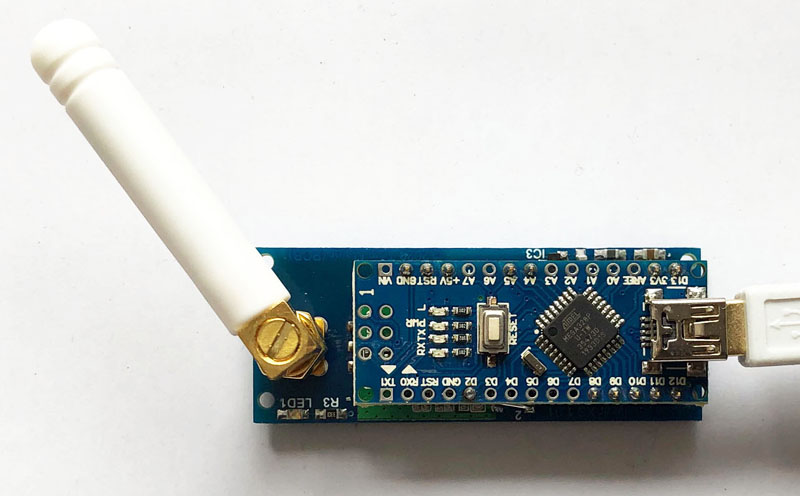

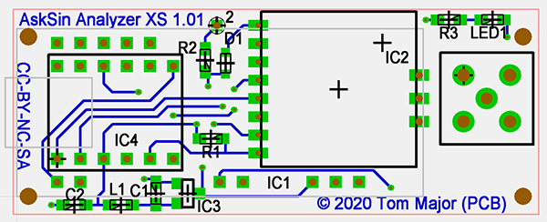

## Schaltplan

[:arrow_right: AskSin Analyzer XS 1.01](https://github.com/TomMajor/SmartHome/tree/master/PCB/AskSin-Analyzer-XS/Files/Analyzer_XS_101.pdf)

## Platine

[:arrow_right: PCB Gerber](Gerber)

## Aufbau

- Zuerst die SMD Bauelemente auf der Oberseite und das Levelshifter-Board bestücken
- auf dem Bild fehlen noch IC3 und D1, diese auch bestücken.
- die Katode (Strich auf dem Gehäuse) von D1 muss nach oben zeigen, zum Lötpad **2** hin
- :warning: Achtung, beim Levelshifter-Board auf die Lage achten, in der oberen Reihe ist das **HV** pin, in der unteren das **LV** pin

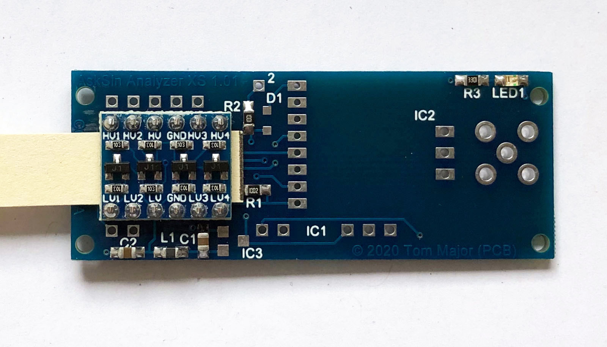

- dann den CC1101 bestücken

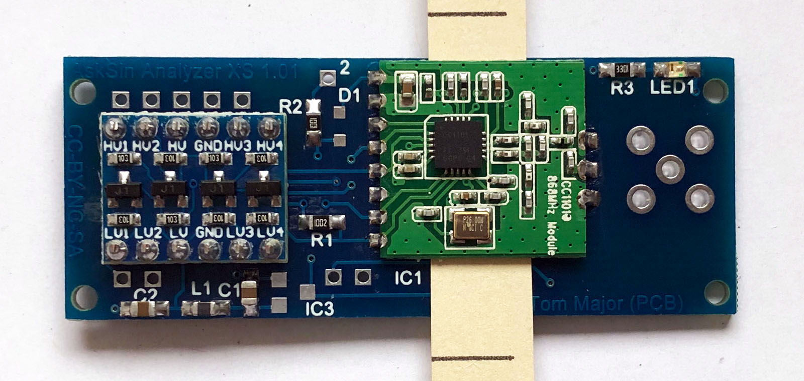

- dann die Stiftleisten (RM 2,54) für den Arduino Nano bestücken (1x5, 1x3, 2x2 pol.)

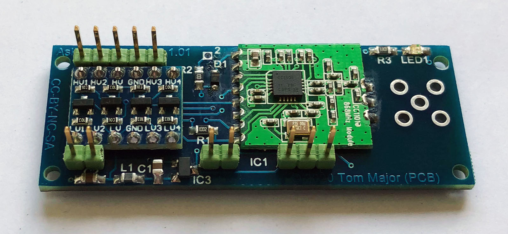

- dann den Arduino Nano einlöten

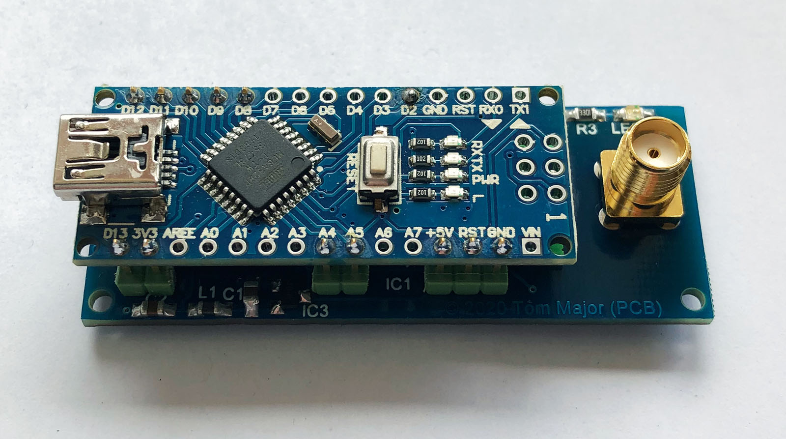

- zum Schluss die SMA-Buchse bestücken und eine Drahtbrücke von Arduino D2 nach Anschluss **2** auf der Platine löten

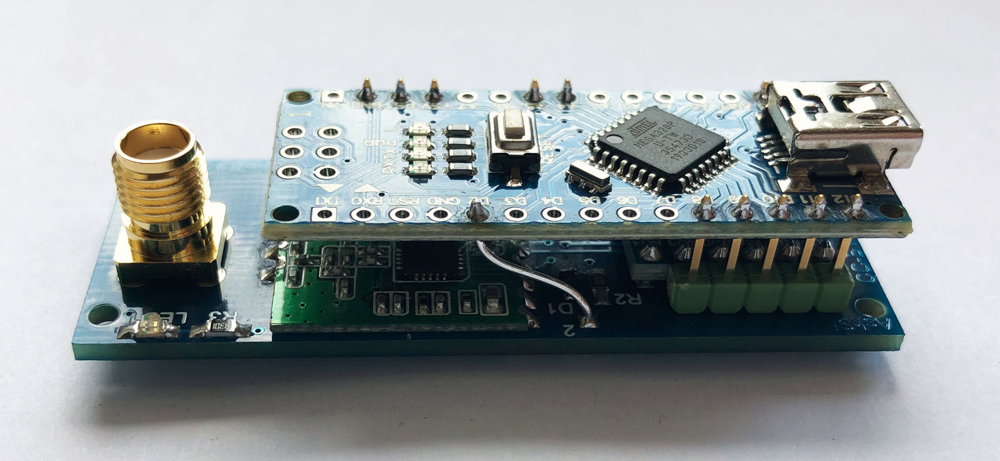

- die Unterseite (Optional: BI-Wünschelrute mit OLED, Lastschaltung für USB-Powerbank) kann zunächst komplett unbestückt bleiben

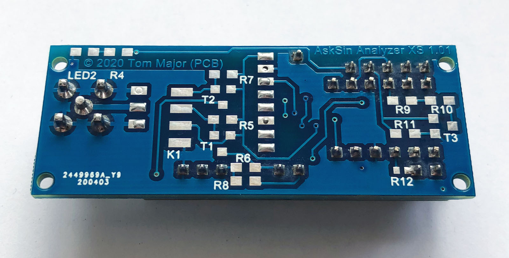

- das fertige Gerät

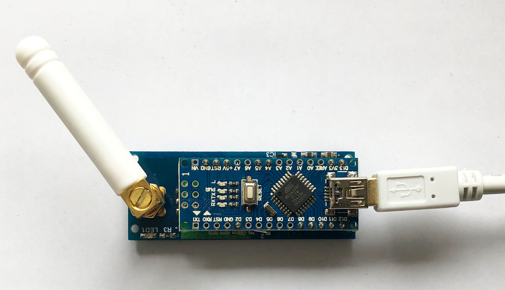

- Bei einem Arduino Nano Clone mit CH340 muss man ggf. in der Arduino-IDE **(Arduino Nano / ATmega328P (Old Bootloader)** einstellen bevor man flashen kann

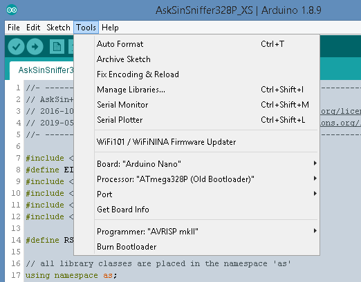

- dann den [Frequenztest](https://github.com/pa-pa/AskSinPP/tree/master/examples/FreqTest) auf den Arduino Nano flashen und ausführen
- dabei folgende Änderung vornehmen: 
`#define LED_PIN 4`
 ändern zu 
`#define LED_PIN 8`

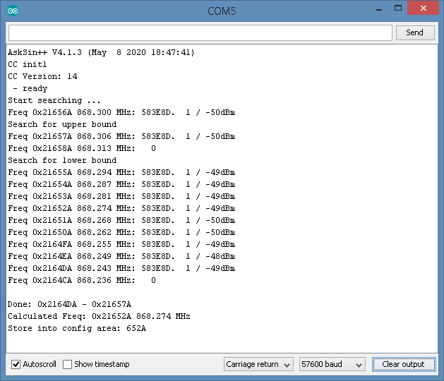

- dann den [AskSinSniffer328P](https://github.com/jp112sdl/AskSinAnalyzer/tree/master/AskSinSniffer328P) auf den Arduino Nano flashen
- dabei folgende Änderung vornehmen: 
`typedef AskSin<StatusLed<4>, NoBattery, Radio<LibSPI<10>, 2>> HalType;`
 ändern zu 
`typedef AskSin<StatusLed<8>, NoBattery, Radio<LibSPI<10>, 2>> HalType;`
- die [AskSinAnalyzerXS Applikation](https://github.com/psi-4ward/AskSinAnalyzerXS/releases) downloaden und dort den seriellen Port des Arduino Nano einstellen, Fertig.

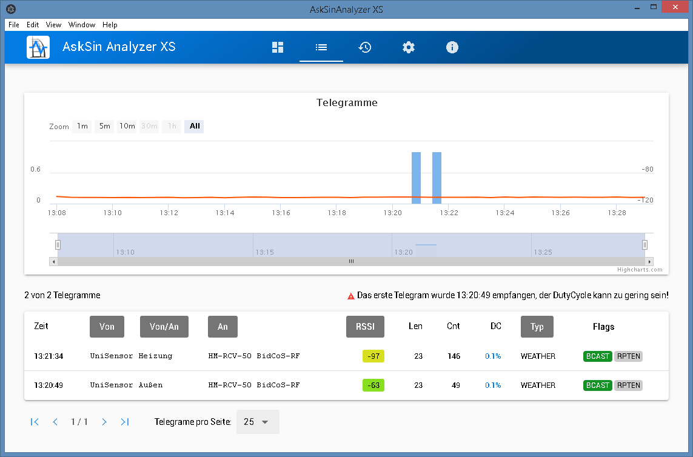

## Stückliste

| Anzahl    | Name      | Wert              | Gehäuse       | Bemerkungen |
|---|---|---|---|---|
| - | R1                | (10k)             | (0805)        | nicht bestücken, das Levelshifter-Board hat bereits pull-ups an jedem Kanal |
| 1 | R2                | 1k                | 0805          | |
| 1 | R3                | 3,3k              | 0805          | |
| 1 | R12               | -                 | 0603          | :warning: nicht bestücken (nur falls man IC3 nicht einsetzen will und man weiß was man tut, siehe unten) |
| 1 | C1                | 10µ               | 0805          | |
| 1 | C2                | 1µ                | 0805          | |
| 1 | IC1	            | Arduino Nano	    | -             | [Beispiel ebay](https://www.ebay.de/itm/Nano-ATmega328-V3-1-Board-CH340-USB-Chip-Arduino-Kompatibel/252742123829) |
| 1 | IC2	            | CC1101	        | -             | |
| 1 | IC3	            | MCP 1754-3302CB   | SOT23-3       | [Beispiel Reichelt](https://www.reichelt.de/ldo-regler-fest-150ma-3-3-v-sot-23-3-mcp-1754-3302cb-p137296.html) |
| 1 | IC4               | 4-fach I2C Levelshifter | 2x6     | [Beispiel ebay](https://www.ebay.de/itm/162352091615) |
| 1 | LED1	            | gelb	            | 0805          | |
| 1 | D1	            | BAT 54J NXP	    | -             | [Beispiel Reichelt](https://www.reichelt.de/schottkydiode-30-v-0-2-a-sod-323f-bat-54j-nxp-p219408.html) |
| 1 | L1	            | BLM21PG 300	    | 0805          | [Beispiel Reichelt](https://www.reichelt.de/emi-suppression-filter-smd0805-blm21-30-ohm-blm21pg-300-p89685.html) |
| 1 | Bu1               | -                 | SMA           | [Beispiel Reichelt](https://www.reichelt.de/sma-steckverbinder-buchse-print-pin-vergoldet-sma-bu-p-p18174.html) |
| 4 | Pfostenleiste     | 1x5, 1x3, 2x2 pol. | RM 2,54      | |
|   |                   |                   |               | |
| 2 | R9,R10            | tbd               | 0805          | Optional: Lastschaltung für USB-Powerbank, auf gewünschten Laststrom auslegen |
| 1 | R11               | 4,7k              | 0805          | Optional: Lastschaltung für USB-Powerbank |
| 1 | T3	            | IRLML6344         | SOT23-3       | Optional: Lastschaltung für USB-Powerbank |
|   |                   |                   |               | |
| 4 | K1                | OLED SSD1306 0,91" 128x32 | -     | Optional: BI-Wünschelrute |
| 4 | R5-R8             | 10k               | 0805          | Optional: BI-Wünschelrute |
| 2 | T1,T2             | BSS138            | SOT23-3       | Optional: BI-Wünschelrute |
| 1 | R4                | 3,3k              | 0805          | Optional: BI-Wünschelrute |
| 1 | LED2	            | gelb	            | 0805          | Optional: BI-Wünschelrute |

## Zusätzlicher 3,3V Spannungsregler (LDO)

- Ich habe einen SOT-23 LDO für die 3,3V Versorgung des CC1101 vorgesehen da mir der verfügbare Ausgangsstrom des CH340C etwas wenig vorkommt. 
siehe auch diese [Infos](http://actrl.cz/blog/index.php/2016/arduino-nano-ch340-schematics-and-details/)

- Für den CC1101 Empfangsmodus mag es auch mit den internen 3,3V vom CH340C gehen, falls man die Platine ggf. im Rahmen eines anderen Projekts auch zum Senden einsetzen will finde ich es sauberer etwas mehr Strom auf der 3,3V Schiene zu haben.

- Und meines Erachtens noch wichtiger, der zusätzliche LDO hat weiterhin den Vorteil dass er Störungen auf der 5V Schiene von der PC Seite stark unterdrückt. 
Da wir hier eine Art HF-Empfangs- und Messgerät bauen kann das nur von Vorteil sein. 
Aus dem gleichen Grund ist weiterhin der Pi-Filter (C-L-C) vor dem CC1101 vorgesehen.

- Wer glaubt den zusätzlichen 3,3V Spannungsregler nicht zu brauchen kann IC3, L1, C1 weglassen und für R12 einen 0-Ohm Widerstand bzw. eine Lötbrücke bestücken, dann werden die internen 3,3V des CH340C verwendet.

- Und was macht die Schaltung mit R2/D1? 
Das GDO0 Pin am CC1101 arbeitet nur in eine Richtung, zum AVR hin, muss aber genau so die 3,3/5V Pegel berücksichtigen. 
Der AVR erkennt ab 3V sicher High-Pegel bei Vcc 5V. Falls fehlerhafterweise ein Sketch auf dem Arduino ist der D2 auf 5V Ausgang setzt, bleibt der CC1101 heil da dieser Pegel über R2/D1 begrenzt wird.

## Prototypenaufbau BI-Wünschelrute (der-pw)

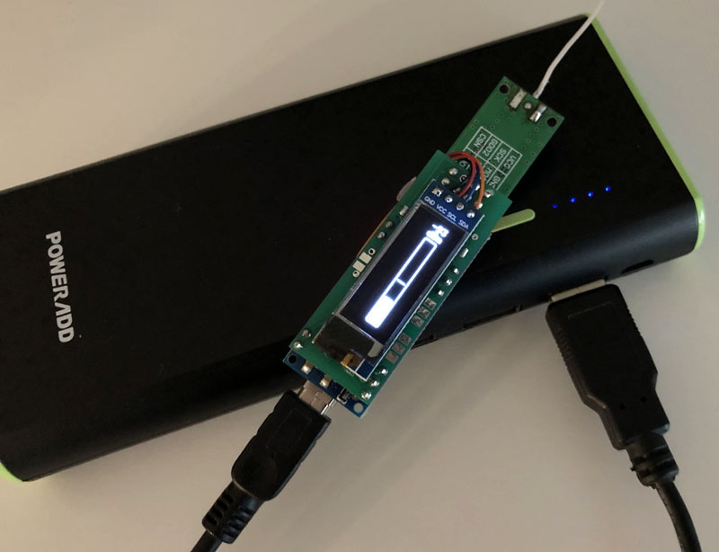

## Gehäuse

* [XS-Board Case von Psi](https://github.com/psi-4ward/AskSin-Analyzer-XS-Board-Case/blob/master/README.md)  
  [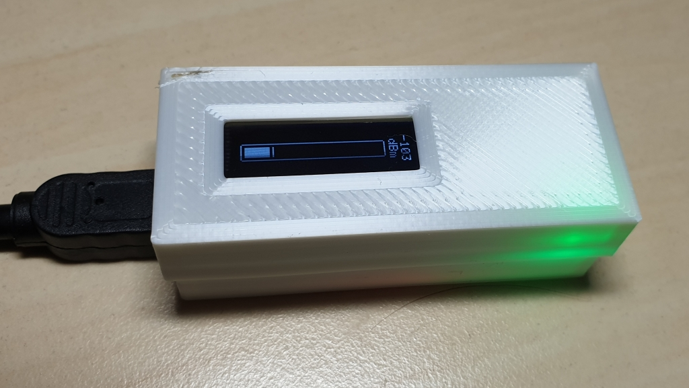](https://github.com/psi-4ward/AskSin-Analyzer-XS-Board-Case/blob/master/README.md)

## Links

[HomeMatic Forum: AskSin Analyzer XS - Der Analyzer als Desktop-App ohne ESP](https://homematic-forum.de/forum/viewtopic.php?f=76&t=56395)

[HomeMatic Forum: AskSinAnalyzer-Sniffer mit Display (BI-Wünschelrute)](https://homematic-forum.de/forum/viewtopic.php?f=76&t=56881)

[AN10441 Level shifting techniques in I2C-bus design](https://github.com/TomMajor/SmartHome/tree/master/PCB/AskSin-Analyzer-XS/Files/AN10441.pdf)

[AN97055 Bi-directional level shifter for I2C-bus and other systems](https://github.com/TomMajor/SmartHome/tree/master/PCB/AskSin-Analyzer-XS/Files/AN97055.pdf)

## Lizenz

**Creative Commons BY-NC-SA** 
Give Credit, NonCommercial, ShareAlike

 This work is licensed under a <a rel="license" href="http://creativecommons.org/licenses/by-nc-sa/4.0/">Creative Commons Attribution-NonCommercial-ShareAlike 4.0 International License</a>.
